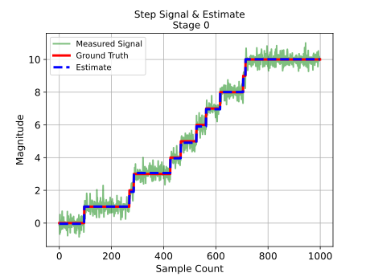
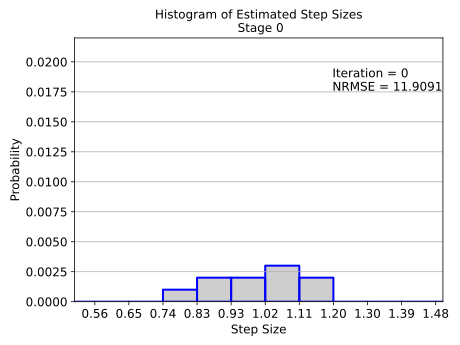
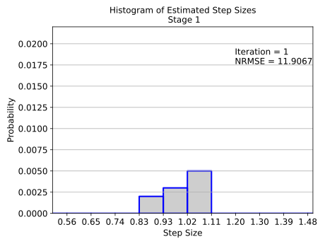
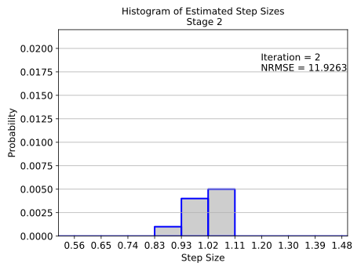
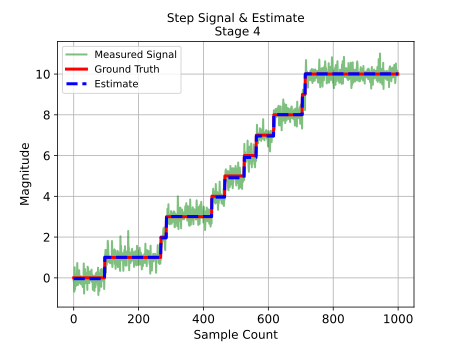
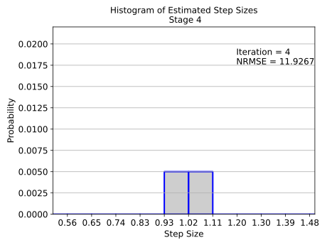

# Step Detection Algorithm (SDA)
A toolbox for detecting steps of unknown size and location in a noisy signal.

# How to use
Here is a sample code to get the estimate of step signals from noisy measurements. 

```python
# Noise standard deviation
sigma = 0.3162 #0.3162 Corresponds to an SNR of 5 for signal of size 1 and a duty ratio of 0.5 


# =============================================================================
# Generating noisy stepping data 
# This section is needed only for sample signal generation. Replace this section 
# with your data. That is, instead of generating the measured signal 'y', 
# assign 'y' to your signal of interest 
# =============================================================================
d = 10 # No. of steps
dt = 0.1 # Sampling interval in s
N = 1000 # total number of samples 
L = 1 # Step size
iterations = 50 # No. of SDA iterations
resolution = 0.05 # Resolution of the SDA
seed = 5 # For reproducibility (change seed for a new signal)
include_dynamics = False # Choose to simulate sensor dynamics 

# Simulating sensor dynamics
SDynObj = SDADynamics()
num = [1] # Specify numerator of sensor transfer function
den = [0.1, 0.8, 1, 1] # Specify denominator of sensor transfer function
sysd = SDynObj.get_DT_sys(num, den, dt)


# Generating a sample stepping signal
SIGObj = SampleSignals()
# Stepping signal
x = SIGObj.get_step_sample(step_size = L, no_steps = d, no_samples = N, bidirectional = 0, seed = seed)
# Noise
noise = SIGObj.get_gaussian_noise(std = sigma, no_samples = N, seed = seed)

if(include_dynamics == True):
    [T, x_sensor] = SIGObj.sensor_dynamics(num, den, dt, x)
    x_sensor = np.expand_dims(x_sensor, axis = 0)
else:
    x_sensor = x
    sysd = None

y = x_sensor + noise  # Noisy measurements

# =============================================================================

# To use the SDA to estimate the stepping signal from data, 
# you would need the standard deviation of noise in the signal.
# Here the standard deviation of noise is denoted by 'sigma'.  
SDAObj = SDA()
[step_estimate, est_array, hist_array]= SDAObj.SDA_dynamics(sigma, y)
SDAObj.plot_SDA_stages(x.T, y, est_array, hist_array)

```
# Example
Here is an example of the Step Detection Algorithm in action. The SDA works in stages, refining & learning about the underlying signal in each stage. 
Shown below is the signal estimate and step size histogram after the first stage. 
<p float="left">
  
   
</p>

After two stages, the step size histogram has been refined, with some of the erroneous sizes eleminated. 
<p float="left">
  
   
</p>

The refinement process continues in stage 3...
<p float="left">
  
   
</p>

and in stage 4. 
<p float="left">
  
   
</p>

At stage 5, no further refinements are achieved in this example and the algorithm stops. The result of this final stage is the output of the SDA. 
<p float="left">
  
   
</p>


# Citation 
To cite SDA, please use the Automatica publication:

- Rajaganapathy, Sivaraman, James Melbourne, and Murti V. Salapaka. "Change detection using an iterative algorithm with guarantees." Automatica 136 (2022): 110075.


# Additional References

- Rajaganapathy, Sivaraman, James Melbourne, Tanuj Aggarwal, Rachit Shrivastava, and Murti V. Salapaka. "Learning and Estimation of Single Molecule Behavior." In 2018 Annual American Control Conference (ACC), pp. 5125-5130. IEEE, 2018.

- Aggarwal, Tanuj, Donatello Materassi, Robert Davison, Thomas Hays, and Murti Salapaka. "Detection of steps in single molecule data." Cellular and molecular bioengineering 5, no. 1 (2012): 14-31.

